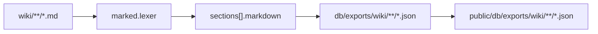
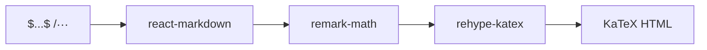
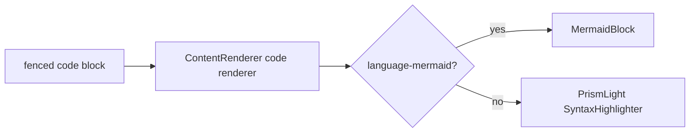
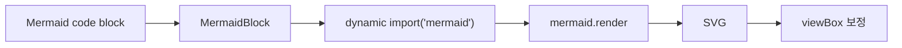

# Code, Math, Mermaid 렌더링 스펙

## 관련 구조

```text
SeraphField/
├── wiki/
│   └── **/*.md
├── db/
│   └── exports/
│       └── wiki/
│           └── **/*.json
└── seraph-field/
    ├── public/
    │   └── db/
    │       └── exports/
    │           └── wiki/
    │               └── **/*.json
    ├── scripts/
    │   ├── export-content.mjs
    │   ├── lint-markdown.mjs
    │   ├── test-lint-markdown.mjs
    │   └── lib/
    │       └── content-utils.mjs
    └── src/
        ├── components/
        │   ├── ContentRenderer.tsx
        │   └── MermaidBlock.tsx
        ├── data/
        │   ├── contentApi.ts
        │   └── types.ts
        ├── pages/
        │   └── WikiPage.tsx
        └── styles/
            └── global.css
```

## Export Shape



개별 section:

```json
{
  "id": "weak-derivative",
  "title": "Weak derivative",
  "markdown": "고전미분은 ...\n\n$$...$$"
}
```

기준:

- section 본문은 `markdown` 필드로 저장합니다.
- `DocumentSection.markdown`은 필수 필드입니다.
- legacy `body`, `equations`, `html` fallback은 사용하지 않습니다.
- `WikiPage`는 `section.markdown`을 `ContentRenderer`에 전달합니다.

## Math



작성 기준:

- inline math는 `$...$`를 사용합니다.
- display math는 `$$...$$`를 사용합니다.
- TeX를 inline code span 안에 넣지 않습니다.
- Markdown table cell 안에는 LaTeX를 피합니다.

동작:

- 본문 수식은 `ContentRenderer`의 Markdown renderer가 처리합니다.
- 긴 display math는 CSS overflow 처리로 보호합니다.
- Mermaid 내부 수식은 Mermaid renderer가 처리합니다.

## Code



동작:

- 코드 박스 header에는 원문 language와 `[CODE]` label을 표시합니다.

등록 언어:

- Bash: `bash`
- C++ 계열: `cpp`, `c++`, `cc`, `cxx`, `hpp`, `cuda`, `cu`
- JavaScript: `javascript`, `js`
- JSON: `json`
- Markdown: `markdown`, `md`
- Python: `python`, `py`
- TypeScript: `typescript`, `ts`, `tsx`

## Mermaid



작성 기준:

- Mermaid diagram은 fenced `mermaid` block만 사용합니다.
- Mermaid label은 짧게 유지합니다.
- 복잡한 설명은 본문 prose나 display math로 배치합니다.

동작:

- strict security, HTML labels, base theme, custom theme variables를 사용합니다.
- 렌더링 뒤 SVG viewBox를 보정합니다.
- toolbar에서 zoom out, zoom in, reset을 제공합니다.
- 모바일에서도 원문 diagram 방향을 유지합니다.

## Mermaid Math Labels

현재 Mermaid 버전:

- `seraph-field/package-lock.json`: `11.16.0`

검증 샘플:

- `wiki/implement/mermaid-math-label-sample.md`

현재 샘플 범위:

- node label의 짧은 수식
- edge label의 짧은 수식
- 긴 scalar label
- Mermaid 밖 display math에 배치한 matrix 환경

자동 검사 범위:

- Mermaid label의 수식은 KaTeX parser로 검사합니다.
- diagram 구조는 label 표시 문자열을 제거한 뒤 Mermaid parser로 검사합니다.
- matrix, cases, aligned, 여러 줄 수식은 Mermaid label에서 오류로 처리합니다.
- 브라우저 SVG 배치와 viewport별 잘림은 자동 검사하지 않습니다.

적용 기준:

- Mermaid label 안의 짧은 `$$...$$` 수식은 허용합니다.
- Matrix, cases, 여러 줄 수식은 Mermaid 밖 display math로 분리합니다.
- label 수식이 실패하면 Mermaid label은 plain text 또는 Unicode 기호만 사용합니다.

## Rendering Defaults

- Code block label은 `[CODE]`입니다.
- Section JSON은 `id`, `title`, `markdown`을 사용합니다.
- Wiki body는 `section.markdown`만 `ContentRenderer`로 렌더링합니다.
- CSS는 `.section-markdown` 스타일을 사용합니다.
- 긴 display math는 CSS overflow로 보호합니다.
- Mermaid는 모바일에서도 원문 방향을 유지합니다.

## 공개 Export 기준

- `db/exports/`와 `seraph-field/public/db/exports/`는 공개 배포물입니다.
- export 결과에는 로컬 절대 경로, `raw/`, `draft/`, `db/local/`, SQLite 파일명이 들어가지 않아야 합니다.
- Markdown 원문을 JSON에 보존하므로 공개 안전성 검사가 필요합니다.
- code fence info string에는 language만 넣습니다.

## Markdown Lint

실행:

```cmd
cd seraph-field
npm run lint:markdown -- ..\wiki
```

파일 하나도 지정할 수 있습니다.

```cmd
npm run lint:markdown -- ..\wiki\implement\mermaid-math-label-sample.md
```

오류 검사:

- 닫히지 않았거나 KaTeX가 해석할 수 없는 `$...$`, `$$...$$`
- `\(...\)`, `\[...\]` 수식 구분자
- inline code와 Markdown table cell 안의 LaTeX
- language가 없거나 metadata가 붙은 fenced code block
- 닫히지 않은 fenced code block
- Mermaid diagram의 label 표시 문자열을 제외한 구조 구문 오류
- Mermaid label 안의 matrix, cases, aligned, 여러 줄 수식

현재 syntax highlighter에 등록되지 않은 code language는 경고로 출력합니다. 오류가 하나 이상이면 종료 코드는 `1`, 검사 대상이 없거나 경로가 잘못되면 `2`입니다.

폴더를 지정하면 하위 Markdown 파일을 재귀 검사하며 `.git`, `dist`, `node_modules`는 제외합니다. Mermaid label의 LaTeX는 원문을 KaTeX로 검사하고, diagram 구조는 Node 환경에서 label 표시 문자열을 제거한 뒤 Mermaid parser로 검사합니다.
