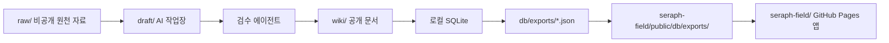
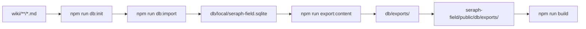

# Seraph Field DB 설계 노트

## 스키마

스키마 기준 파일은 [../db/schema.sql](../db/schema.sql)입니다.

## 저장 경계



## 디렉터리 역할

- `raw/`: 비공개 원천 자료입니다. AI 작성 워크플로에서는 읽기 전용으로 취급합니다.
- `draft/`: 새 문서와 기존 위키 문서 수정본의 작업장입니다.
- `wiki/`: 검수 완료된 공개 Markdown 문서입니다.
- `db/schema.sql`: 로컬 SQLite 메타데이터의 스키마 기준입니다.
- `db/local/`: 로컬 SQLite 스냅샷 위치입니다. 커밋하지 않습니다.
- `db/exports/`: 로컬 SQLite에서 생성한 공개 JSON의 저장소 기준 산출 위치입니다.
- `seraph-field/public/db/exports/`: GitHub Pages 앱이 fetch하는 공개 JSON 위치입니다.
- `seraph-field/`: 공개 JSON을 읽는 React/Vite 사이트입니다.

## SQLite 역할

- SQLite는 로컬 메타데이터 저장소입니다.
- GitHub Pages 입력은 export된 JSON 파일입니다.
- export 스크립트는 현재 SQLite 상태에서 JSON을 재생성합니다.
- 배포용 정적 앱은 `seraph-field/public/db/exports/`에 복사된 JSON을 fetch합니다.

## 실행 흐름



명령:

- `npm run db:init`: `db/schema.sql`을 기준으로 로컬 SQLite 파일을 준비합니다.
- `npm run db:import`: `wiki/**/*.md`와 frontmatter를 SQLite에 반영합니다.
- `npm run export:content`: SQLite import를 먼저 실행한 뒤 공개 JSON을 다시 만들고 사이트 public 폴더로 복사합니다.
- `npm run dev`: `npm run export:content` 후 Vite 개발 서버를 실행합니다.
- `npm run build`: `npm run export:content`, TypeScript build, Vite build를 순서대로 실행합니다.

## 공개 JSON 출력

export 파일:

- `db/exports/documents.json`
- `db/exports/search-index.json`
- `db/exports/tags.json`
- `db/exports/series.json`
- `db/exports/groups.json`
- `db/exports/repositories.json`
- `db/exports/wiki/**/*.json`

사이트 배포 위치:

```text
db/exports/documents.json
-> seraph-field/public/db/exports/documents.json

db/exports/wiki/theory/function-spaces.json
-> seraph-field/public/db/exports/wiki/theory/function-spaces.json
```

개별 본문 JSON:

- `sections`는 `id`, `title`, `markdown`을 가집니다.
- `markdown`은 React의 `ContentRenderer`가 수식, 코드, Mermaid 렌더링에 사용합니다.
- `documents.json`의 각 문서는 `contentRelpath`로 개별 본문 JSON을 가리킵니다.
- `search-index.json`을 생성합니다. 앱 검색은 로드된 `documents` 배열을 필터링합니다.

## 문서 메타데이터

SQLite와 공개 JSON의 정규화된 문서 레코드는 다음 필드를 가집니다.

- `slug`
- `title`
- `summary`
- `category`
- `layout`: `wiki` 또는 `standalone`
- `role`: `content`, `profile`, `not-found`, `content-unavailable`, `empty-category`
- `wiki_relpath`
- `created_at`
- `updated_at`
- 태그
- 선택적 series
- 선택적 groups
- 선택적 repository

frontmatter에서 생략한 필드는 다음 값으로 채웁니다.

| 필드 | fallback |
| --- | --- |
| `slug` | `wiki/` 기준 상대 경로에서 확장자를 제거한 값 |
| `title` | 첫 H1, H1이 없으면 파일명 |
| `summary` | 첫 문단 |
| `category` | 첫 경로 구간, 유효하지 않으면 `THEORY` |
| `created_at` | 파일 생성 시각 |
| `updated_at` | 파일 수정 시각 |

`layout`과 `role`은 Markdown frontmatter에서 읽어 공개 문서 JSON에 포함합니다. `layout` 기본값은 `wiki`, `role` 기본값은 `content`입니다. 프로필과 상태 문서도 일반 문서와 같은 import, export, 검색 흐름을 사용합니다.

`wiki_relpath`는 frontmatter 입력이 아니라 파일 위치에서 계산한 `wiki/` 기준 상대 경로입니다. 로컬 절대 경로를 저장하지 않습니다.

입력 frontmatter:

```yaml
groups:
  - metadata-system
  - site-navigation
series: groups-series-import
series_title: Groups and Series Import
series_order: 1
```

객체형 series 입력:

```yaml
series:
  id: groups-series-import
  title: Groups and Series Import
  order: 1
```

## Series와 Groups

Series:

- 문서는 최대 하나의 series에 속합니다.
- `series` 문자열은 `series.id`로 저장합니다.
- `series_title`은 `series.title`로 저장합니다.
- `series_order`가 읽기 순서를 결정합니다.
- `series.json`에는 series 제목과 정렬된 문서 목록을 포함합니다.

Groups:

- 문서는 여러 group에 속할 수 있습니다.
- group은 주제 묶음과 범위 검색에 사용합니다.
- `groups.json`에는 group 제목, 문서 수, 관련 문서 목록을 포함합니다.

공개 목록 형태:

```json
{
  "id": "metadata-system",
  "title": "metadata-system",
  "count": 1,
  "documents": [
    { "slug": "implement/groups-series-example", "title": "Groups and Series Validation Sample", "category": "IMPLEMENT" }
  ]
}
```

## REPO 버전 추적

REPO 문서는 외부 repository를 읽고 공부한 내용을 정리하는 영역입니다. 예시는 PyTorch, ComfyUI 같은 외부 구현 repository입니다.

사용 테이블:

- `repositories`: 외부 repository의 안정적인 식별 정보
- `repository_snapshots`: 버전 또는 최종 확인일 기록

repository에 명시적 버전이 없으면 `version`은 비워두고 `checked_at`을 로컬 freshness 신호로 사용합니다. 공개 `repositories.json`은 repository 정보와 연결 문서 목록을 포함합니다. snapshot의 `version`과 `checked_at`은 로컬 메타데이터로 유지합니다.

## Draft 수정 흐름

```mermaid
flowchart LR
    Published["wiki/document.md"] --> Copy["draft/document.md"]
    Copy --> Edit["draft 수정"]
    Edit --> Safety["공개 안전성 검수"]
    Safety --> Content["단일 문서 내용 검토"]
    Content --> Consistency["정합성/중복/통폐합 검토"]
    Consistency --> Style["문서 스타일 검토"]
    Style --> Promote["Orchestrator wiki 반영"]
    Promote --> Replace["wiki 문서 대체"]
    Replace --> Import["SQLite 동기화"]
    Import --> Export["db/exports JSON 재생성"]
    Export --> Public["seraph-field/public/db/exports 복사"]
```



검토 축:

- 공개 안전성: 보안, 로컬 경로, 개인정보, 공개 가능성
- 단일 문서 내용: 설명 정확성, 빠진 부분, 내부 모순
- 정합성과 중복: 기존 `raw/` 또는 배포된 `wiki/`와의 정합성, 중복 여부, 통폐합 여지
- 문서 스타일: 구성 포맷, 제목 체계, 표현 방식, 문장 톤

## 활동 이벤트

`document_events`는 다음 워크플로 이벤트를 저장합니다.

- `draft_created`
- `review_requested`
- `review_passed`
- `review_failed`
- `published`
- `updated`
- `archived`

기록 위치:

- `recordDocumentEvent(database, { documentId, eventType, actor, draftRelpath, note })`는 `seraph-field/scripts/lib/sqlite-store.mjs`에 둡니다.
- `npm run db:import`는 문서 upsert 뒤 `published` 또는 `updated`를 기록합니다.
- wiki 목록에서 사라져 이번 실행에서 새로 `archived` 상태가 된 문서만 `archived`를 기록합니다.

`document_events`는 로컬 운영 메타데이터이며 공개 JSON export에서 제외합니다.

## 공개 안전 기준

- `raw/`와 `draft/` 콘텐츠를 export하지 않습니다.
- 로컬 절대 경로를 export하지 않습니다.
- 로컬 SQLite 파일을 export하지 않습니다.
- 공개 export에는 검수된 위키 메타데이터와 정적 사이트 검색 데이터만 포함합니다.
- export 스크립트는 공개 JSON 생성 뒤 금지 경로와 SQLite 파일명 패턴을 검사합니다.
