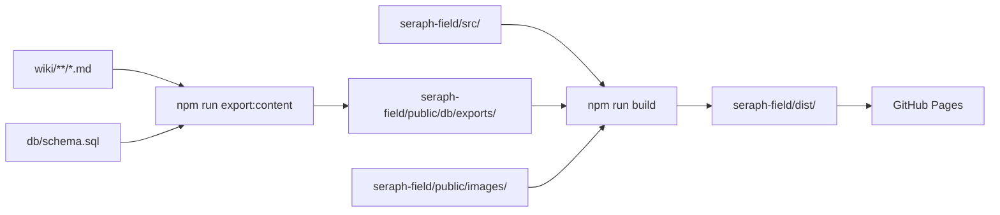

# Seraph Field Git 공개 범위

## 전체 구조

```text
SeraphField/
├── .github/                 GitHub Pages workflow
├── .gitignore               로컬·생성 파일 제외 규칙
├── db/
│   └── schema.sql           공개 문서 메타데이터 스키마
├── docs/                    프로젝트 설계와 운영 기준
├── schema/                  수학 문서 작성 지침
├── seraph-field/            React/Vite 사이트 소스와 정적 자산
└── wiki/                    공개 Markdown 원고
```

## [A1] 필수 공개 범위: 사이트 빌드와 문서 운영에 사용

| 경로 | 포함 내용 | 사용 위치 |
| --- | --- | --- |
| `.github/workflows/deploy-pages.yml` | GitHub Pages 빌드와 배포 workflow | GitHub Actions |
| `.gitignore` | 비공개·로컬·생성 파일 제외 규칙 | Git 추적 범위 |
| `db/schema.sql` | SQLite 테이블과 관계 정의 | `npm run db:init`, `npm run export:content`, `npm run build` |
| `docs/` | UI, DB, 렌더링, Git 공개 범위 | 프로젝트 운영 |
| `schema/` | 수학 구조와 표기 작성 지침 | 위키 원고 작성 |
| `wiki/` | 본문, 프로필, 상태 문서 | JSON export 입력 |
| `seraph-field/index.html` | Vite HTML 진입점 | 사이트 빌드 |
| `seraph-field/package.json` | 의존성과 실행 명령 | 설치와 빌드 |
| `seraph-field/package-lock.json` | 고정된 npm 의존성 버전 | 재현 가능한 설치 |
| `seraph-field/tsconfig.json` | TypeScript 설정 | TypeScript build |
| `seraph-field/vite.config.ts` | GitHub Pages base와 Vite 설정 | Vite build |
| `seraph-field/scripts/` | wiki import, SQLite, JSON export, Markdown lint | 빌드 전처리 |
| `seraph-field/src/` | React 화면, renderer, 검색, 스타일 | 사이트 runtime |
| `seraph-field/public/favicon.svg` | favicon | 정적 자산 |
| `seraph-field/public/icons.svg` | 공용 아이콘 | 정적 자산 |
| `seraph-field/public/images/` | 로비 배경과 공개 이미지 | 정적 자산 |

## [A2] 빌드 생성물: workflow에서 다시 생성

```text
db/exports/
seraph-field/public/db/exports/
seraph-field/dist/
seraph-field/tsconfig.tsbuildinfo
```

- `npm run export:content`는 `wiki/`와 `db/schema.sql`을 사용해 두 export 디렉터리를 다시 만듭니다.
- `npm run export:content`는 중간 상태를 `db/local/seraph-field.sqlite`에 만들거나 갱신합니다.
- `npm run build`는 export 이후 `seraph-field/dist/`를 만듭니다.
- GitHub Pages workflow는 `seraph-field/dist/`를 배포 artifact로 업로드합니다.

## [A3] 비공개·로컬 범위: Git 추적 제외 대상

다음 경로와 패턴을 `.gitignore`에 반영합니다.

```text
raw/
draft/
reference/
.agents/
.venv/
db/local/
seraph-field/node_modules/
local.settings.json
.env
.env.*
*.sqlite
*.db
*.log
```

- `raw/`는 교재, 논문, 대화 묶음 같은 비공개 원천 자료를 보관합니다.
- `draft/`는 검수 전 작업본을 보관합니다.
- `reference/`는 기존 구현 비교 자료와 별도 저장소 메타데이터를 포함할 수 있습니다.
- `db/local/`은 로컬 SQLite 상태를 보관합니다.
- 환경 설정, 비밀값, 로컬 데이터베이스, 로그는 공개 저장소에 포함하지 않습니다.

## [A4] GitHub Pages 입력과 출력



화살표는 앞 경로가 뒤 단계의 입력으로 사용됨을 뜻합니다.

## [A5] 업로드 전 확인

- 추적 대상이 [A1] 범위에 들어가는지 확인합니다.
- [A2] 생성물이 source 변경과 함께 섞이지 않았는지 확인합니다.
- [A3] 경로와 로컬 절대경로가 diff에 없는지 확인합니다.
- 토큰, 비밀번호, 이메일, 개인 URL, 계정 식별자가 없는지 확인합니다.
- `npm run lint:markdown -- ../docs`와 `npm run lint:markdown -- ../wiki`를 실행합니다.
- `npm run build`가 성공한 뒤 `seraph-field/dist/`만 Pages artifact로 배포되는지 확인합니다.
