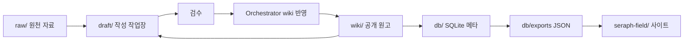

# Seraph Field 프로젝트 구조

## 전체 구조

```text
SeraphField/
  raw/
  draft/
  wiki/
  db/
  docs/
  schema/
  reference/
  seraph-field/
```

루트 폴더 이름은 소문자 기준으로 맞춥니다. `reference/`는 기존 Seraph Field 참고 자료이고, 새 공개 사이트의 직접 입력이 아닙니다.

## 흐름



## [A1] raw/: 비공개 원천 자료

`raw/`는 지식 소스별 원문 자료를 보관합니다.

역할:

- 교재, 논문, 가이드, 대화 묶음 같은 원천 자료 보관
- AI 작성 작업의 읽기 전용 입력
- GitHub Pages 공개 대상에서 제외

운영 기준:

- LLM은 `raw/`를 수정하지 않습니다.
- 사이트 빌드는 `raw/`를 직접 읽지 않습니다.
- 공개 문서에는 `raw/`의 로컬 절대 경로를 쓰지 않습니다.

## [A2] draft/: AI 작성과 수정 작업장

`draft/`는 새 문서 작성과 기존 위키 문서 수정 작업을 처리합니다.

역할:

- `raw/`와 기존 `wiki/`를 바탕으로 초안 작성
- 기존 공개 문서를 수정할 때의 임시 작업장
- 검토와 검수 대상 문서 보관

검토 축:

- 공개 안전성: 보안, 로컬 경로, 개인정보, 공개 가능성
- 단일 문서 내용: 문서 하나만 놓고 봤을 때의 설명 정확성, 빠진 부분, 내부 모순
- 정합성과 중복: 기존 `raw/` 또는 배포된 `wiki/` 문서와의 정합성, 중복 여부, 통폐합 여지
- 문서 스타일: 구성 포맷, 제목 체계, 표현 밀도, 문장 톤

작업 파일은 `draft/` 바로 아래에 둡니다.

수정 흐름:

```text
wiki/<slug>.md
  -> draft/<slug>.md
  -> 공개 안전성 검수
  -> 단일 문서 내용 검토
  -> 정합성/중복/통폐합 검토
  -> 문서 스타일 검토
  -> 메타데이터/DB 검토
  -> Orchestrator Agent wiki 반영
  -> wiki/<slug>.md 대체
```

## [A3] wiki/: 공개 확정 문서

`wiki/`는 검수 완료된 공개 Markdown 문서의 canonical 위치입니다.

역할:

- GitHub Pages에 공개될 본문 원고
- 검색과 문서 목록의 기준 입력
- 프로필 문서 같은 사이트 내부 페이지의 원천

기준:

- 검수 전 문서를 직접 넣지 않습니다.
- 수정 작업은 `draft/`에서 한 뒤 검수 완료본으로 대체합니다.
- Orchestrator Agent가 모든 리뷰 통과 후 `draft/` 문서를 `wiki/`에 반영합니다.
- 공개 가능한 상대 링크와 공개 가능한 메타데이터만 포함합니다.
- `wiki/theory/`는 수학, 물리 같은 교과서 레벨 이론이나 쉽게 변하지 않는 지식을 정리하는 문서 영역입니다.
- `wiki/paper/`는 논문, article처럼 가변성이 있고 비판적으로 검토하며 읽어야 하는 자료를 정리하는 문서 영역입니다.
- `wiki/repo/`는 PyTorch, ComfyUI 같은 외부 repository를 읽고 분석한 문서 영역입니다.
- `wiki/implement/`는 직접 실습하거나 구현한 코드와 파이프라인을 정리하는 문서 영역입니다.
- `wiki/system/`은 존재하지 않는 주소, 본문 로드 실패, 빈 카테고리 상태에 표시할 문서를 보관합니다.
- `wiki/profile.md`는 standalone 프로필 화면의 원문입니다.
- group/series는 문서 frontmatter 메타데이터로 관리하고, 사이트 본문 아래 `Series and Groups` 탐색 구역에서 사용합니다.

## [A4] db/: 메타데이터와 export 기준

`db/`는 검색과 문서 메타데이터를 위한 SQLite 설계와 JSON export 기준을 담습니다.

역할:

- SQLite 스키마 기준 관리
- 문서 메타, 태그, series, group, repository snapshot 관리
- GitHub Pages용 JSON export 위치 제공

구조:

```text
db/
  schema.sql
  local/
  exports/
    wiki/
```

기준:

- [../db/schema.sql](../db/schema.sql)을 스키마 기준으로 봅니다.
- `db/local/`의 SQLite 파일은 로컬 관리용입니다.
- `db/exports/`는 SQLite에서 생성한 공개 JSON의 저장소 기준 산출 위치입니다.
- GitHub Pages 앱은 배포 시 `seraph-field/public/db/exports/`에 놓인 JSON을 읽습니다.

## [A5] docs/: 설계와 작업 기준

`docs/`는 새 세션에서 구현자가 읽는 설계 문서 위치입니다.

주요 문서:

- [design-notes.html](design-notes.html)
- [db-design-notes.md](db-design-notes.md)
- [code-math-mermaid-rendering.md](code-math-mermaid-rendering.md)
- [ui-spec.md](ui-spec.md)
- [ui-spec-mobile.md](ui-spec-mobile.md)
- [project-structure.md](project-structure.md)

예시 페이지:

```text
docs/example_page/
  lobby-simple-sample.html
  wiki-layout-responsive-sample.html
  search-layout-sample.html
```

`design-notes.html`과 `docs/example_page/`는 React 구현 전에 만든 간단한 시각 견본입니다. 현재 동작 기준은 React 코드와 `ui-spec.md`, `ui-spec-mobile.md`, `code-math-mermaid-rendering.md`를 함께 확인합니다.

## [A6] schema/: 지침과 스키마 참고 자료

`schema/`는 수학 지침과 작성 기준 같은 참고 자료를 보관합니다.

역할:

- 원천 자료를 위키 문서로 전환할 때 참고하는 작성 지침 보관
- 사이트 런타임과 JSON export의 직접 입력에서는 제외

## [A7] reference/: 기존 구현 참고 자료

`reference/`는 기존 Seraph Field 사이트와 코드 참고 자료입니다.

역할:

- 새 구조로 이식할 때 필요한 비교 자료 보관
- `reference/SeraphField/seraph-field-site/`의 UI 구현과 사양을 화면 동작 비교 기준으로 사용
- 새 공개 사이트 구조의 직접 입력에서는 제외

## [A8] seraph-field/: 공개 사이트 코드

`seraph-field/`는 React/Vite 기반 GitHub Pages 사이트입니다.

역할:

- 로비, 위키 본문, 검색, standalone 화면 구현
- 프로필과 상태별 Markdown 문서 렌더링
- `seraph-field/public/db/exports/`의 공개 JSON 렌더링
- 공개 정적 사이트 빌드

구현 기준:

- 로비, 본문, 검색의 시각 방향은 `docs/example_page/` 샘플을 참고합니다.
- 기존 Seraph Field와 같은 UI가 필요한 기능은 `reference/SeraphField/seraph-field-site/`의 React 구현을 비교 기준으로 봅니다.
- 모바일과 데스크탑은 같은 컴포넌트 구조를 사용합니다.
- 모든 화면은 `PageTransition`의 opacity와 blur 교차 전환을 사용합니다.
- `prefers-reduced-motion`에서는 전환을 생략합니다.
