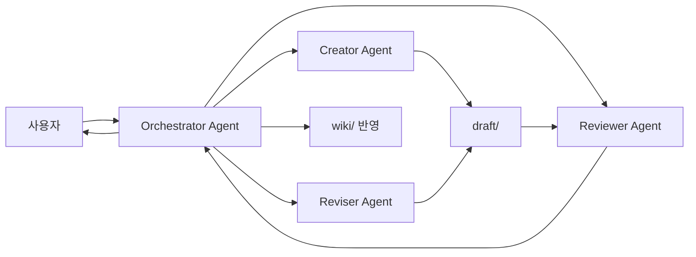

# Seraph Field 서브에이전트 설계

## 전체 모델



## [A0] Orchestrator Agent: 사용자 대화와 위임 조율

담당:

- 사용자 요청 해석
- 작업 범위와 완료 기준 정리
- 필요한 입력 자료 지정
- 작업에 맞는 서브에이전트 타입 선택
- Creator, Reviser, Reviewer 생성과 종료
- 서브에이전트 결과 수집
- 한 서브에이전트의 결과를 다른 서브에이전트에 전달
- 사용자에게 필요한 질문 전달
- 모든 리뷰 통과 후 `draft/` 문서를 `wiki/`에 반영
- 최종 결과와 남은 이슈 요약

하지 않는 일:

- 문서 본문 직접 작성
- 문서 본문 직접 수정
- 전문 검토 직접 수행
- 리뷰를 통과하지 않은 문서의 `wiki/` 반영

출력:

- 사용자에게 보여줄 작업 요약
- 서브에이전트 지시문
- 검토 결과 요약
- 사용자 확인이 필요한 선택지

## [B1] Creator Agent: 신규 draft 생성

공통 입력:

- 사용자 요청
- 관련 `raw/` 자료
- 참고할 기존 `wiki/` 문서
- 문서 목적
- 예상 category, tags, series, groups

공통 출력:

- `draft/` 문서 초안
- frontmatter 초안
- 참고한 자료 목록
- 불확실한 부분

Creator 타입:

| 타입 | 역할 |
| --- | --- |
| `content_creator` | 새 위키 문서 초안 작성 |
| `summary_creator` | 긴 원천 자료를 위키용 요약 초안으로 변환 |
| `repo_note_creator` | repository 분석 문서 초안 작성 |
| `profile_creator` | 프로필 또는 사이트 소개 문서 초안 작성 |

## [B2] Reviser Agent: 기존 draft 수정

공통 입력:

- 수정 대상 문서
- 사용자 수정 요청
- reviewer 피드백
- 관련 `raw/` 또는 `wiki/` 문서

공통 출력:

- `draft/` 수정본
- 반영한 변경 요약
- 반영하지 못한 피드백
- 사용자 확인이 필요한 부분

Reviser 타입:

| 타입 | 역할 |
| --- | --- |
| `content_reviser` | 내용 보강과 설명 수정 |
| `style_reviser` | 구성, 제목, 문장 톤, 표현 밀도 수정 |
| `merge_reviser` | 중복 문서 통폐합 초안 작성 |
| `safety_reviser` | 공개 안전성 이슈 제거 |
| `metadata_reviser` | frontmatter, tags, series, groups 정리 |

## [B3] Reviewer Agent: 검토 전용

검토 결과를 반환하고 문서를 직접 수정하지 않습니다.

공통 입력:

- 검토 대상 draft 문서
- 필요한 비교 대상 `raw/` 또는 `wiki/`
- 검토 타입
- 차단 조건

공통 출력:

- 통과 여부
- 문제 목록
- 위치 또는 근거
- 수정 제안
- 다음에 호출할 Reviser 타입 제안

Reviewer 타입:

| 타입 | 역할 |
| --- | --- |
| `public_safety_reviewer` | 보안, 로컬 경로, 개인정보, 공개 가능성 검토 |
| `content_correctness_reviewer` | 단일 문서 내용 정확성, 빠진 전제, 내부 모순 검토 |
| `corpus_consistency_reviewer` | 기존 `raw/`와 배포된 `wiki/` 대비 정합성, 중복, 통폐합 여지 검토 |
| `document_style_reviewer` | 구성 포맷, 제목 체계, 표현 방식, 문장 톤 검토 |
| `metadata_db_reviewer` | slug, 날짜, tags, series, groups, repository snapshot, JSON export 필드 검토 |
| `ui_implementation_reviewer` | 사이트 구현과 `docs/example_page/` 샘플의 차이 검토 |

## 문서 게시 전 권장 흐름

```text
Orchestrator Agent
  -> Creator Agent 또는 Reviser Agent
  -> Reviewer Agent: public_safety_reviewer
  -> Reviewer Agent: content_correctness_reviewer
  -> Reviewer Agent: corpus_consistency_reviewer
  -> Reviewer Agent: document_style_reviewer
  -> Reviewer Agent: metadata_db_reviewer
  -> 필요한 Reviser Agent 재호출
  -> Orchestrator Agent가 draft 문서를 wiki/에 반영
  -> Orchestrator Agent가 사용자에게 결과 보고
```

## 사이트 구현 중 권장 흐름

```text
Orchestrator Agent
  -> Reviser Agent 또는 구현 작업자
  -> Reviewer Agent: ui_implementation_reviewer
  -> Orchestrator Agent가 사용자에게 결과 보고
```

## 생성과 종료 기준

서브에이전트는 작업 단위로 임시 생성합니다.

생성 기준:

- 입력 자료와 목표가 명확함
- 한 에이전트가 맡을 타입이 하나로 정해짐
- 출력 형식이 정해져 있음

종료 기준:

- 지정한 출력이 생성됨
- 차단 조건이 발견됨
- Orchestrator Agent가 결과를 다른 에이전트나 사용자에게 전달함

## TOML 전환 기준

권장 구조:

```text
orchestrator
creator.types[]
reviser.types[]
reviewer.types[]
```

각 타입은 다음 항목을 갖습니다.

- 이름
- 목적
- 읽기 허용 폴더
- 쓰기 허용 폴더
- 입력 형식
- 출력 형식
- 차단 조건

권장 쓰기 범위:

- Creator Agent는 `draft/`에 씁니다.
- Reviser Agent는 `draft/`에 씁니다.
- Reviewer Agent는 기본적으로 문서를 직접 수정하지 않습니다.
- Reviewer Agent의 결과는 별도 리뷰 로그나 Orchestrator Agent 응답으로 전달합니다.
- `wiki/` 대체는 모든 리뷰 통과 후 Orchestrator Agent가 wiki 반영 단계에서 수행합니다.
- `db/` 갱신은 metadata/db 단계 또는 wiki 반영 이후 작업에서 수행합니다.
