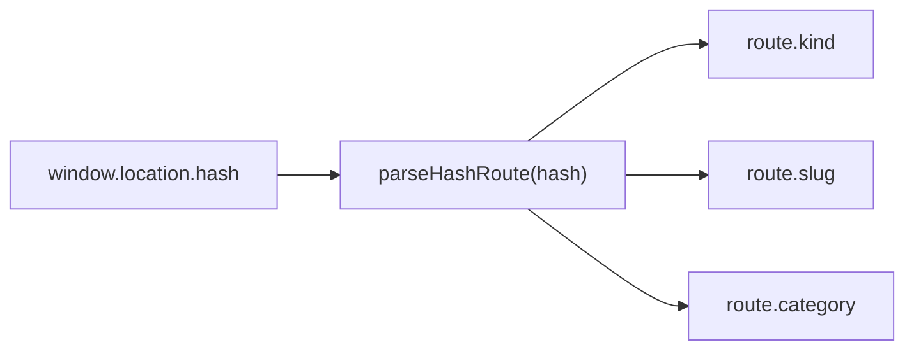
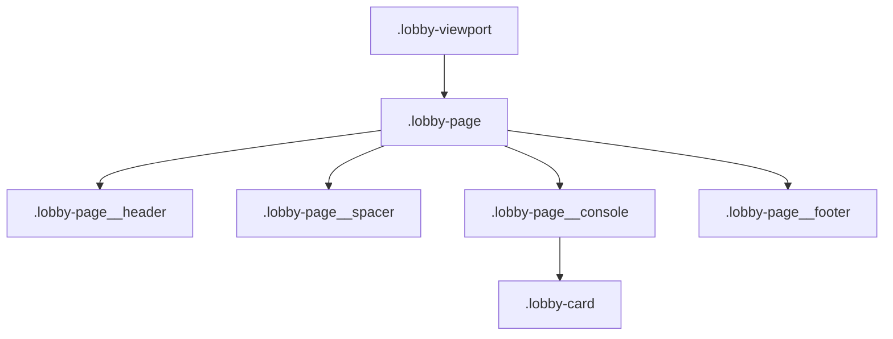
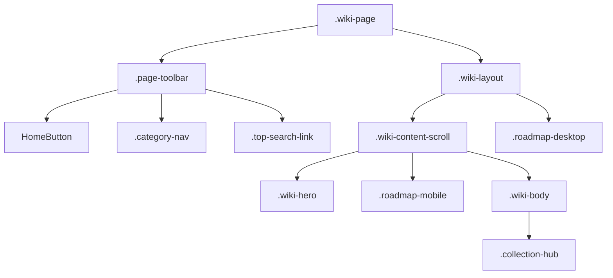
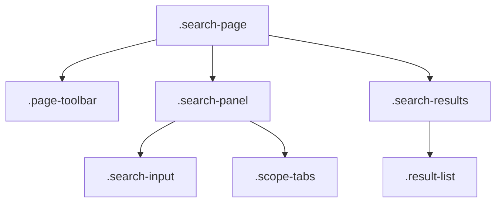

# Seraph Field UI 레이아웃/모바일 스펙

## 관련 구조

```text
SeraphField/
├── docs/
│   ├── design-notes.html
│   └── example_page/
│       ├── lobby-simple-sample.html
│       ├── search-layout-sample.html
│       └── wiki-layout-responsive-sample.html
└── seraph-field/
    └── src/
        ├── pages/
        │   ├── LobbyPage.tsx
        │   ├── SearchPage.tsx
        │   ├── StandalonePage.tsx
        │   └── WikiPage.tsx
        ├── components/
        │   └── PageTransition.tsx
        └── styles/
            └── global.css
```

## 공통 기준

- 로비, 위키, 검색은 같은 페이지 컴포넌트를 사용합니다.
- 화면 폭 차이는 CSS 배치와 표시 전환으로 처리합니다.
- 문서 로드맵은 `.roadmap-mobile`과 `.roadmap-desktop`을 함께 렌더링하고 화면 폭에 따라 하나만 표시합니다.
- `Series and Groups`는 `.collection-hub` 구조를 사용하고 화면 폭에 따라 header 또는 toggle로 표시합니다.
- 페이지 전환은 `PageTransition`의 opacity와 blur 교차 보간을 사용합니다.
- `prefers-reduced-motion`에서는 전환을 생략합니다.
- 상단 유틸리티 아이콘은 조용한 회청색 톤으로 둡니다.
- 좌측 원형 홈 버튼은 `#/`로 이동합니다.

## Routes



라우팅 대상:

- 로비: `#/`
- 위키 본문: `#/wiki/<slug>`
- 카테고리 진입: `#/wiki?category=<CATEGORY>`
- 검색: `#/search`
- 프로필: `#/wiki/profile`
- 존재하지 않는 주소: `not-found` 역할 문서

## Lobby Layout



카테고리:

- `THEORY`
- `PAPER`
- `REPO`
- `IMPLEMENT`

동작:

- 검색은 상단 아이콘으로 검색 페이지를 엽니다.
- 프로필은 `#/wiki/profile` 경로에서 standalone 레이아웃으로 엽니다.
- 모바일은 카테고리 카드를 한 열로 쌓습니다.
- 넓은 화면에서는 두 열 배치와 우측 배치를 사용할 수 있습니다.

## Wiki Layout



데스크탑:

- 본문은 읽기 폭 안에서 중앙 정렬합니다.
- 상단 카테고리 아이콘 행은 본문 폭에 맞춰 중앙 정렬합니다.
- 문서 로드맵은 우측 목차 패널로 표시합니다.
- `Series and Groups`는 본문 아래 `collection-hub`로 펼쳐서 표시합니다.
- `.wiki-content-scroll`이 `overflow-y: auto`와 `padding-bottom: 45vh`를 담당합니다.

모바일:

- 우측 목차 패널은 숨깁니다.
- 문서 메타데이터 아래에 접이식 `Document Roadmap` 블록을 표시합니다.
- 본문 아래 `Series and Groups`는 접힌 상태로 시작합니다.
- `Series and Groups`를 열면 `Series`와 각 `Group`도 각각 접힌 상태로 시작합니다.
- 같은 series 문서가 2개 미만이면 series cluster를 표시하지 않습니다.
- 같은 group의 다른 문서가 없으면 해당 group card를 표시하지 않습니다.
- 상단 카테고리 아이콘 행은 그대로 유지하고 중앙 정렬합니다.
- 검색은 우측 상단 작은 아이콘으로 유지합니다.
- `.wiki-content-scroll`은 `overflow: visible`과 `padding-bottom: 35vh`를 사용합니다.
- 카테고리 문서가 없으면 `empty-category` 역할 문서를 standalone 레이아웃으로 표시합니다.

## Standalone Layout

- 프로필과 상태 문서는 `.standalone-page`와 `.standalone-layout`을 사용합니다.
- 제목, 요약, Markdown section을 한 열로 표시합니다.
- 상단에는 홈 버튼, 카테고리 탐색, 검색 아이콘을 유지합니다.
- 모바일에서는 본문 바깥 여백과 제목 크기를 줄입니다.

## Search Layout



동작:

- 검색 범위는 `All`, `Title`, `Tag`, `Group`, `Series` 칩으로 선택합니다.
- 검색 범위 선택에 네이티브 `select`를 사용하지 않습니다.
- 모바일과 데스크탑은 같은 결과 카드 구조를 사용합니다.
- 데스크탑에서는 결과 칩을 카드 우측에 붙일 수 있습니다.
- 모바일에서는 결과 메타, 요약, 칩이 세로로 쌓입니다.

## 색상과 폰트

- 배경: `#0e1012`
- HUD 시안: `#19b8be`, 대부분 낮은 opacity로 사용
- 유틸리티 아이콘: `rgba(196, 220, 222, 0.72)`에 가까운 회청색
- 표시 폰트: `Teko`
- 모노 폰트: `Share Tech Mono`
- 본문 폰트: `Noto Sans KR`
