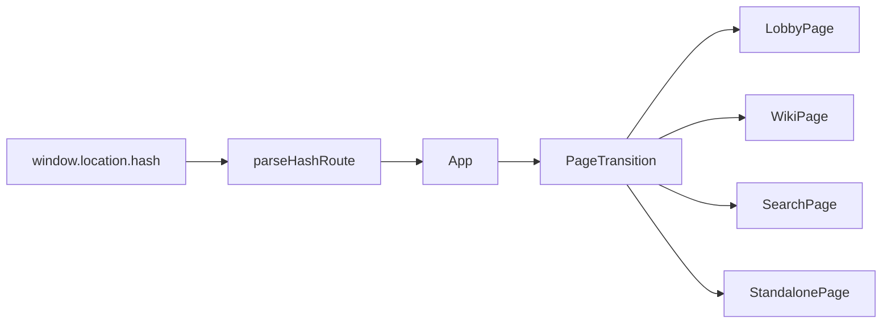
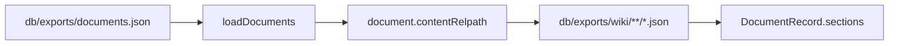
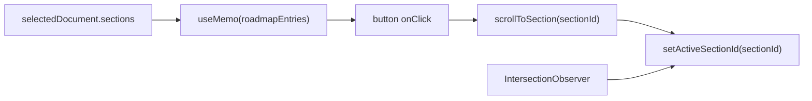
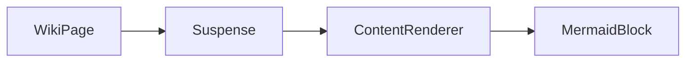

# Seraph Field UI 스펙

## 관련 구조

```text
SeraphField/
└── seraph-field/
    └── src/
        ├── app/
        │   ├── App.tsx
        │   └── routes.ts
        ├── components/
        │   ├── ContentRenderer.tsx
        │   ├── HomeButton.tsx
        │   ├── MermaidBlock.tsx
        │   └── PageTransition.tsx
        ├── data/
        │   ├── contentApi.ts
        │   └── search.ts
        ├── pages/
        │   ├── LobbyPage.tsx
        │   ├── SearchPage.tsx
        │   ├── StandalonePage.tsx
        │   └── WikiPage.tsx
        └── styles/
            └── global.css
```

## Page Flow



## Data Loading



동작:

- `DocumentRecord.wikiRelpath`는 데이터 필드로 유지합니다. `WikiPage` JSX는 이 필드를 생략합니다.
- `DocumentRecord.groups`는 group id 또는 title 문자열 배열입니다.
- `DocumentRecord.series`는 `id`, `title`, `order`를 가집니다.
- `DocumentRecord.layout`은 `wiki` 또는 `standalone`입니다.
- `DocumentRecord.role`은 일반 콘텐츠와 상태별 대체 문서를 구분합니다.
- `contentAvailable`은 본문 JSON에 내용이 있는지 나타냅니다.
- `documents.json` fetch가 실패하거나 유효한 문서 목록이 비어 있으면 fixture 문서를 사용합니다.
- 개별 본문 JSON fetch가 실패하거나 section 본문이 비어 있으면 해당 문서의 `contentAvailable`을 `false`로 유지하고 `content-unavailable` 역할 문서를 표시합니다.

## Lobby

```text
main.lobby-viewport
└── section.lobby-page
    ├── .lobby-page__backdrop
    ├── .lobby-page__overlay
    ├── .lobby-page__hud-tint
    ├── .lobby-page__vignette
    └── .lobby-page__content
        ├── header.lobby-page__header
        │   └── UtilityNav
        ├── .lobby-page__spacer
        ├── nav.lobby-page__console
        │   └── a.lobby-card
        └── footer.lobby-page__footer
```

동작:

- `.lobby-page__backdrop`은 `images/lobby-backdrop.png`를 배경으로 사용합니다.
- 카테고리 카드는 `THEORY`, `PAPER`, `REPO`, `IMPLEMENT`를 렌더링합니다.
- 각 카드는 `#/wiki?category=<CATEGORY>`로 이동합니다.
- 로비에는 로고 이미지, 프로필 이미지, 생성 이미지, 최근 문서 목록, 검색 입력창을 렌더링하지 않습니다.

## Category Index

```text
main.wiki-page
├── header.page-toolbar
│   ├── HomeButton
│   ├── CategoryNav
│   └── a.top-search-link
└── section.wiki-index
    ├── h1
    └── div.wiki-index__list
        └── a
            ├── span
            ├── strong
            └── p
```

동작:

- `route.category`가 있고 `route.slug`가 없으면 카테고리 목록 화면을 렌더링합니다.
- 목록은 `documents.filter((document) => document.category === route.category)` 결과입니다.
- 카테고리 목록이 비어 있으면 `empty-category` 역할 문서를 `StandalonePage`로 렌더링합니다.
- 각 항목은 `#/wiki/<slug>`로 이동합니다.
- 항목에는 `updatedAt`, `title`, `summary`를 표시합니다.

## Wiki Page

```text
main.wiki-page
├── header.page-toolbar
│   ├── HomeButton
│   ├── CategoryNav
│   └── a.top-search-link
└── article.wiki-layout
    ├── div.wiki-content-scroll
    │   ├── header.wiki-hero
    │   ├── details.roadmap-mobile
    │   └── div.wiki-body
    │       ├── section#section-id
    │       │   ├── h2
    │       │   └── ContentRenderer
    │       └── section.collection-hub
    └── aside.roadmap-desktop
```

동작:

- `WikiPage`는 `contentRef = useRef<HTMLDivElement>(null)`를 선언합니다.
- `.wiki-content-scroll`에 `ref={contentRef}`를 연결합니다.
- `.wiki-content-scroll` 안에 `.wiki-hero`, `.roadmap-mobile`, `.wiki-body`를 모두 배치합니다.
- `.wiki-body`에는 독립 스크롤을 주지 않습니다.
- `.roadmap-desktop`은 `.wiki-content-scroll` 밖의 sibling입니다.
- `.roadmap-mobile`은 `.wiki-content-scroll` 안의 `details` 요소입니다.
- `.collection-hub`는 `.wiki-body` 안에서 본문 section들 뒤에 렌더링합니다.

## Series And Groups

```text
section.collection-hub
├── .collection-hub__header 또는 button.collection-hub__toggle
├── .collection-cluster
│   ├── .collection-cluster__header 또는 button.collection-cluster__toggle
│   ├── .collection-nav-grid
│   │   └── a.collection-nav-card
│   └── .collection-series-list
│       └── a.collection-series-item
└── .collection-cluster
    └── .collection-group-grid
        └── .collection-group-card
            ├── .collection-group-card__header 또는 button.collection-group-card__toggle
            └── .collection-group-card__list
                └── a.collection-group-item
```

동작:

- 같은 series에 속한 문서가 2개 이상이면 series cluster를 표시합니다.
- series cluster는 이전 문서, 다음 문서, 전체 series 문서 목록을 표시합니다.
- 같은 group에 속한 다른 문서가 있으면 group cluster를 표시합니다.
- group card는 최대 5개 관련 문서를 표시하고, 더 있으면 남은 수를 표시합니다.
- `Search Series`는 `#/search?q=series:<id>`로 이동합니다.
- `Open Search`는 `#/search?q=group:<id>`로 이동합니다.
- reference UI 기준은 `reference/SeraphField/seraph-field-site/src/components/ArchiveMarkdown.tsx`의 `collection-hub` 구조입니다.

## Roadmap



동작:

- 각 로드맵 `<li>`에는 `data-active={activeSectionId === item.id}`를 지정합니다.
- 문서가 바뀌면 첫 section을 active로 두고 `.wiki-content-scroll`을 맨 위로 보냅니다.
- `IntersectionObserver`는 각 `section.id` 요소를 observe합니다.
- observer 옵션은 `{ root: scrollRoot, rootMargin: '-10% 0% -72% 0%' }`입니다.
- 내부 스크롤이 가능하면 `requestAnimationFrame`으로 `root.scrollTop`을 `560ms` 동안 보간합니다.
- 내부 스크롤이 불가능하면 `element.scrollIntoView({ behavior: 'smooth', block: 'start' })`를 사용합니다.
- cleanup에서 남은 `requestAnimationFrame`을 취소합니다.

## Search Page

```text
main.search-page
├── header.page-toolbar
│   ├── HomeButton
│   ├── .page-toolbar__title
│   └── UtilityNav
├── section.search-panel
│   ├── label.search-input
│   └── div.scope-tabs
└── section.search-results
    ├── .search-meta
    └── .result-list
```

동작:

- 검색 입력은 `query` state로 관리합니다.
- 검색 범위는 `All`, `Title`, `Tag`, `Group`, `Series`입니다.
- 범위 선택은 `scope-tabs` 버튼으로 처리합니다.
- 검색 결과는 `searchDocuments(documents, query, scope)` 결과입니다.
- `group:<id>`와 `series:<id>` 쿼리는 선택된 scope와 별개로 해당 메타데이터를 직접 필터링합니다.
- 검색은 로드된 `documents` 배열을 필터링합니다.

## Standalone Page

```text
main.standalone-page
├── header.page-toolbar
│   ├── HomeButton
│   ├── CategoryNav
│   └── a.top-search-link
└── article.standalone-layout
    ├── header.standalone-hero
    │   ├── h1
    │   └── p
    └── div.standalone-body
        └── section
            ├── h2
            └── ContentRenderer
```

동작:

- `layout: standalone` 문서는 공통 툴바와 Markdown renderer를 유지합니다.
- 프로필은 `role: profile`을 사용합니다.
- 존재하지 않는 주소는 `role: not-found` 문서를 표시합니다.
- 본문이 없거나 로드되지 않으면 `role: content-unavailable` 문서를 표시합니다.
- 빈 카테고리는 `role: empty-category` 문서를 표시합니다.
- 역할 문서도 문서 목록과 검색 데이터에 포함됩니다.

## Page Transition

- `App`은 현재 라우트로 `routeKey`를 만들고 모든 페이지를 `PageTransition`으로 감쌉니다.
- `PageTransition`은 `AnimatePresence`의 `popLayout` 모드를 사용합니다.
- 전환 시간은 `260ms`이며 opacity와 `3px` blur를 교차 보간합니다.
- 모바일과 데스크탑은 같은 전환을 사용합니다.
- `prefers-reduced-motion`이 활성화되면 전환 시간을 `0`으로 둡니다.

## Markdown Body



동작:

- `WikiPage`는 각 section의 `markdown`을 `ContentRenderer`에 전달합니다.
- `ContentRenderer`는 lazy import됩니다.
- fallback은 `.section-markdown.section-markdown--loading`입니다.
- 수식, 코드, Mermaid 세부 동작은 [code-math-mermaid-rendering.md](code-math-mermaid-rendering.md)를 기준으로 봅니다.
