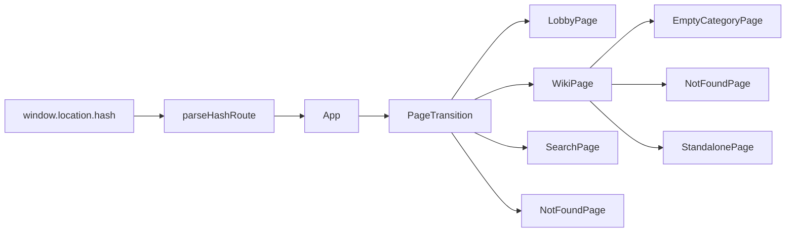
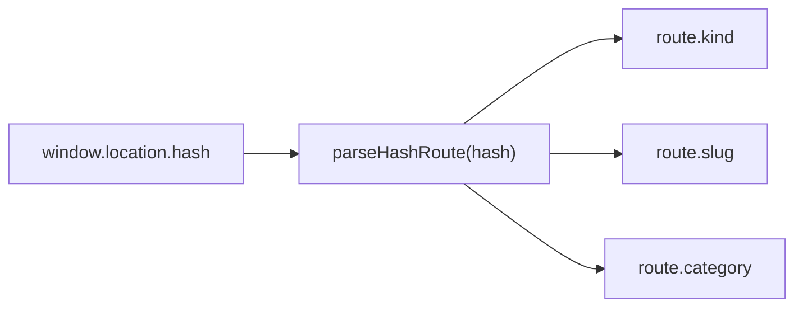
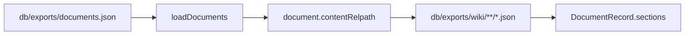
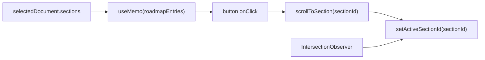
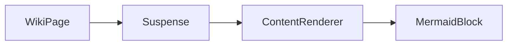

# Seraph Field Web Interface Specification

## [A] 전체 동작

### [A-1] 관련 구조

```text
SeraphField/
└── seraph-field/
    └── src/
        ├── app/
        │   ├── App.tsx
        │   └── routes.ts
        ├── components/
        │   ├── CategoryNav.tsx
        │   ├── ContentRenderer.tsx
        │   ├── HomeButton.tsx
        │   ├── MermaidBlock.tsx
        │   ├── PageTransition.tsx
        │   └── UtilityNav.tsx
        ├── data/
        │   ├── contentApi.ts
        │   └── search.ts
        ├── pages/
        │   ├── EmptyCategoryPage.tsx
        │   ├── LobbyPage.tsx
        │   ├── NotFoundPage.tsx
        │   ├── SearchPage.tsx
        │   ├── StandalonePage.tsx
        │   └── WikiPage.tsx
        └── styles/
            └── global.css
```

레이아웃 시각 견본:

```text
SeraphField/
└── docs/
    ├── design-notes.html
    └── example_page/
        ├── lobby-simple-sample.html
        ├── search-layout-sample.html
        └── wiki-layout-responsive-sample.html
```

### [A-2] 페이지 흐름



### [A-3] 라우팅



라우팅 대상:

- 로비: `#/`
- 위키 본문: `#/wiki/<slug>`
- 카테고리 진입: `#/wiki?category=<CATEGORY>`
- 검색: `#/search`
- 프로필: `#/wiki/profile`
- `PROFILE`도 유효한 카테고리이므로 `#/wiki?category=PROFILE`로 목록을 열 수 있지만, 로비와 `CategoryNav`에는 링크를 표시하지 않습니다.

### [A-4] 데이터 로딩



동작:

- `DocumentRecord.wikiRelpath`는 데이터 필드로 유지합니다. `WikiPage` JSX는 이 필드를 생략합니다.
- TypeScript 모델에서 `DocumentRecord.groups`는 group id 또는 title 문자열 배열입니다.
- TypeScript 모델에서 `DocumentRecord.series`는 `id`, `title`, `order`를 가집니다.
- TypeScript 모델에서 `DocumentRecord.layout`은 `wiki` 또는 `standalone`입니다.
- TypeScript 모델에서 `DocumentRecord.role`은 일반 콘텐츠와 상태별 대체 문서를 구분합니다.
- `contentAvailable`은 본문 JSON에 내용이 있는지 나타냅니다.
- export 인덱스의 런타임 필수 검증 필드는 `slug`, `title`, `summary`, `category`입니다. `groups`는 잘못된 값이면 빈 배열, `layout`은 `standalone` 외에는 `wiki`, `role`은 알려진 역할 외에는 `content`로 정규화합니다.
- `documents.json` fetch가 실패하거나 유효한 문서 목록이 비어 있으면 fixture 문서를 사용합니다.
- fixture에는 상태 역할 문서가 없고 fixture 프로필은 일반 위키 레이아웃입니다. 이때 빈 카테고리와 존재하지 않는 주소는 컴포넌트 내장 fallback을 표시합니다.
- 개별 본문 JSON fetch가 실패하거나 모든 section에 비공백 Markdown이 없으면 해당 문서의 `contentAvailable`을 `false`로 유지하고, 역할 문서가 있으면 `content-unavailable` 문서를 표시합니다.

## [B] 공통 UI

### [B-1] 툴바와 탐색

- 좌측 원형 홈 버튼은 `#/`로 이동합니다.
- `UtilityNav`는 로비에서 홈, 프로필, 검색을 표시합니다.
- 검색 화면은 별도 홈 버튼과 프로필만 표시합니다.
- 위키, 카테고리 목록, standalone 화면은 홈 버튼, `THEORY`·`PAPER`·`REPO`·`IMPLEMENT` 카테고리 아이콘, 검색을 표시합니다.
- `CategoryNav`는 현재 카테고리 아이콘에 `data-active="true"`를 지정합니다.

### [B-2] 반응형 기준

- 로비, 위키, 검색은 화면 폭이 달라도 각각 같은 페이지 컴포넌트를 유지합니다.
- 기본 레이아웃과 표시 전환은 CSS media query로 처리합니다.
- 위키의 `Series and Groups`는 `window.innerWidth < 1024`와 `resize` 이벤트로 관리하는 `isCompactViewport` state에 따라 데스크탑과 compact DOM을 다르게 렌더링합니다.

### [B-3] 페이지 전환과 모션

- `App`은 현재 라우트로 `routeKey`를 만들고 모든 페이지를 `PageTransition`으로 감쌉니다.
- `PageTransition`은 `AnimatePresence`의 `popLayout` 모드를 사용합니다.
- 전환 시간은 `260ms`이며 opacity와 `3px` blur를 교차 보간합니다.
- 모바일과 데스크탑은 같은 전환을 사용합니다.
- `prefers-reduced-motion`이 활성화되면 전환 시간을 `0`으로 둡니다.

### [B-4] 색상과 타이포그래피

- 배경: `#0e1012`
- HUD 시안: `#19b8be`, 대부분 낮은 opacity로 사용
- 유틸리티 아이콘: `rgba(196, 220, 222, 0.72)`에 가까운 회청색
- 표시 폰트: `Teko`
- 모노 폰트: `Share Tech Mono`
- 본문 폰트: `Noto Sans KR`

### [B-5] 특수 렌더링

코드 블록, 수식, Mermaid의 작성법, 지원 범위, 오류 기준은 [code-math-mermaid-rendering.md](code-math-mermaid-rendering.md)를 따릅니다.

- 코드·수식·Mermaid 블록의 위아래 간격: `24px`

| 요소 | 글꼴 / 크기 | 줄높이 | 내부 간격 |
|---|---|---|---|
| 코드 헤더 | `Share Tech Mono`, `12.16px`, `400` | `21.28px` | padding `8px 16px` |
| 코드 본문 | `Share Tech Mono`, `13px`, `400` | `19.5px` | padding `16px` |
| display 수식 | `19.36px`, `400` | `23.232px` | padding `16px` |
| Mermaid toolbar | `Share Tech Mono`, `12.16px`, `400` | `21.28px` | gap `12px`; padding `8px 16px`; 아래 `8.8px` |
| Mermaid control | `Share Tech Mono`, `13.12px`, `400` | `1` | 최소 폭 `34.4px`; 높이 `32px`; control gap `6.4px` |
| Mermaid surface | `Noto Sans KR` label | `1.35` | padding `14.4px 14.4px 16px` |

테두리와 배경:

- 코드: `1px rgba(25, 184, 190, 0.3)`, 배경 `rgba(0, 0, 0, 0.85)`
- display 수식: `1px rgba(25, 184, 190, 0.12)`, 왼쪽 `3px #19B8BE`, 배경 `rgba(3, 5, 7, 0.9)`
- Mermaid surface: `1px rgba(25, 184, 190, 0.3)`, 배경 `rgba(4, 6, 8, 0.92)` 위 시안 gradient

## [C] 페이지별 사양

### [C-1] 로비

#### 구조와 동작

```text
main.lobby-viewport
└── section.lobby-page
    ├── .lobby-page__backdrop
    ├── .lobby-page__overlay
    ├── .lobby-page__hud-tint
    ├── .lobby-page__vignette
    └── .lobby-page__content
        ├── header.lobby-page__header
        │   └── UtilityNav
        ├── .lobby-page__spacer
        ├── nav.lobby-page__console
        │   └── a.lobby-card
        └── footer.lobby-page__footer
```

동작:

- `.lobby-page__backdrop`은 `images/lobby-backdrop.png`를 배경으로 사용합니다.
- 카테고리 카드는 `THEORY`, `PAPER`, `REPO`, `IMPLEMENT`를 렌더링합니다.
- 각 카드는 `#/wiki?category=<CATEGORY>`로 이동합니다.
- 로비에는 로고 이미지, 프로필 이미지, 생성 이미지, 최근 문서 목록, 검색 입력창을 렌더링하지 않습니다.

#### 반응형 배치

- 검색은 상단 아이콘으로 검색 페이지를 엽니다.
- 모바일은 카테고리 카드를 한 열로 쌓습니다.
- `560px` 초과에서는 카테고리 카드가 두 열이며, `900px` 이상에서는 콘솔을 우측에 배치합니다.
- `1180px` 이상에서는 콘솔 폭을 `430px`, 우측 여백을 `24px`로 고정합니다.

### [C-2] 카테고리 목록

#### 구조와 동작

```text
main.wiki-page
├── header.page-toolbar
│   ├── HomeButton
│   ├── CategoryNav
│   └── a.top-search-link
└── section.wiki-index
    ├── h1
    └── div.wiki-index__list
        └── a
            ├── span
            ├── strong
            └── p
```

동작:

- `route.category`가 있고 `route.slug`가 없으면 카테고리 목록 화면을 렌더링합니다.
- 목록은 `documents.filter((document) => document.category === route.category)` 결과입니다.
- 카테고리 목록이 비어 있으면 `empty-category` 역할 문서를 `StandalonePage`로 렌더링합니다.
- 각 항목은 `#/wiki/<slug>`로 이동합니다.
- 항목에는 `updatedAt`, `title`, `summary`를 표시합니다.

### [C-3] 위키 본문

#### 구조와 동작

```text
main.wiki-page
├── header.page-toolbar
│   ├── HomeButton
│   ├── CategoryNav
│   └── a.top-search-link
└── article.wiki-layout
    ├── div.wiki-content-scroll
    │   ├── header.wiki-hero
    │   ├── details.roadmap-mobile
    │   └── div.wiki-body
    │       ├── section#section-id
    │       │   ├── h2
    │       │   └── ContentRenderer
    │       └── section.collection-hub
    └── aside.roadmap-desktop
```

동작:

- `WikiPage`는 `contentRef = useRef<HTMLDivElement>(null)`를 선언합니다.
- `.wiki-content-scroll`에 `ref={contentRef}`를 연결합니다.
- `.wiki-body`에는 독립 스크롤을 주지 않습니다.

#### Series And Groups

```text
section.collection-hub
├── .collection-hub__header 또는 button.collection-hub__toggle
├── .collection-cluster
│   ├── .collection-cluster__header 또는 button.collection-cluster__toggle
│   ├── .collection-nav-grid
│   │   └── a.collection-nav-card
│   └── .collection-series-list
│       └── a.collection-series-item
└── .collection-cluster
    └── .collection-group-grid
        └── .collection-group-card
            ├── .collection-group-card__header 또는 button.collection-group-card__toggle
            └── .collection-group-card__list
                └── a.collection-group-item
```

동작:

- 같은 series에 속한 문서가 2개 이상이면 series cluster를 표시합니다.
- series cluster는 이전 문서, 다음 문서, 전체 series 문서 목록을 표시합니다.
- 같은 group에 속한 다른 문서가 있으면 group cluster를 표시합니다.
- 같은 group의 다른 문서가 없으면 해당 group card를 표시하지 않습니다.
- group card는 최대 5개 관련 문서를 표시하고, 더 있으면 남은 수를 표시합니다.
- `Search Series`는 `#/search?q=series:<id>`로 이동합니다.
- `Open Search`는 `#/search?q=group:<id>`로 이동합니다.
- reference UI 기준은 `reference/SeraphField/seraph-field-site/src/components/ArchiveMarkdown.tsx`의 `collection-hub` 구조입니다.

#### 문서 로드맵



동작:

- 각 로드맵 `<li>`에는 `data-active={activeSectionId === item.id}`를 지정합니다.
- 문서가 바뀌면 첫 section을 active로 두고 `.wiki-content-scroll`을 맨 위로 보냅니다.
- `IntersectionObserver`는 각 `section.id` 요소를 observe합니다.
- observer 옵션은 `{ root: scrollRoot, rootMargin: '-10% 0% -72% 0%' }`입니다.
- 내부 스크롤이 가능하면 `requestAnimationFrame`으로 `root.scrollTop`을 `560ms` 동안 보간합니다.
- 내부 스크롤이 불가능하면 `element.scrollIntoView({ behavior: 'smooth', block: 'start' })`를 사용합니다.
- cleanup에서 남은 `requestAnimationFrame`을 취소합니다.

#### Markdown 본문



동작:

- `WikiPage`는 각 section의 `markdown`을 `ContentRenderer`에 전달합니다.
- `ContentRenderer`는 lazy import됩니다.
- fallback은 `.section-markdown.section-markdown--loading`입니다.

#### 시각 수치

- 기준 목업: `docs/example_page/wiki-layout-responsive-sample.html`
- 기준 콘텐츠: `wiki/implement/mermaid-math-label-sample.md`
- 문서 영역: 최대 `900px`, 좌우 padding `24px`, 내부 콘텐츠 최대 `852px`

| 요소 | 글꼴 / 크기 | 줄높이 | 간격 |
|---|---|---|---|
| 문서 제목 | `Teko`, `64px`, `500` | `0.92` | 아래 `14px` |
| 문서 요약 | `Noto Sans KR`, `16.8px`, `300` | `1.8` | 아래 `26px` |
| 섹션 제목 | `Teko`, `40px`, `700` | `1` | 위 `32px`, 아래 `16px` |
| 본문 | `Noto Sans KR`, `16.8px`, `300` | `1.8` | 문단 아래 `24px` |

샘플 검증값:

- 두 줄 코드 블록 전체 높이: `111.27px`
- fallback matrix 수식 영역: 약 `235.6 × 46.44px`
- fallback matrix 박스 전체 높이: 약 `80.45px`

모바일 `1023px` 이하:

| 요소 | 크기 | 줄높이 | 간격 |
|---|---|---|---|
| 문서 제목 | `40px` | `0.98` | 아래 `11.2px` |
| 문서 요약 / 본문 | `15.04px` | `1.7` | 문단 아래 `24px` |
| 섹션 제목 | `28.8px` | `1.05` | 위 `24px`, 아래 `12.8px` |
| 페이지 | 전체 폭 | 기본 본문 흐름 | 좌우 `16px` |

정적 목업은 `global.css`와 `ContentRenderer.tsx`의 선언을 기준으로 동기화합니다. 샘플 검증값은 현재 샘플 콘텐츠와 폰트가 로드된 브라우저에서 확인한 값입니다.

#### 반응형 배치

데스크탑:

- 본문은 읽기 폭 안에서 중앙 정렬합니다.
- 상단 카테고리 아이콘 행은 본문 폭에 맞춰 중앙 정렬합니다.
- 문서 로드맵은 우측 목차 패널로 표시합니다.
- `Series and Groups`는 본문 아래 `collection-hub`로 펼쳐서 표시합니다.
- `.wiki-content-scroll`이 `overflow-y: auto`와 `padding-bottom: 45vh`를 담당합니다.

모바일:

- 우측 목차 패널은 숨깁니다.
- 문서 메타데이터 아래에 접이식 `Document Roadmap` 블록을 표시합니다.
- 본문 아래 `Series and Groups`는 접힌 상태로 시작합니다.
- `Series and Groups`를 열면 `Series`와 각 `Group`도 각각 접힌 상태로 시작합니다.
- 상단 카테고리 아이콘 행은 그대로 유지하고 중앙 정렬합니다.
- 검색은 우측 상단 작은 아이콘으로 유지합니다.
- `.wiki-content-scroll`은 `overflow: visible`과 `padding-bottom: 35vh`를 사용합니다.

### [C-4] 검색

#### 구조와 동작

```text
main.search-page
├── header.page-toolbar
│   ├── HomeButton
│   ├── .page-toolbar__title
│   └── UtilityNav
├── section.search-panel
│   ├── label.search-input
│   └── div.scope-tabs
└── section.search-results
    ├── .search-meta
    └── .result-list
```

동작:

- 검색 입력은 `query` state로 관리합니다.
- 검색 범위는 `All`, `Title`, `Tag`, `Group`, `Series` 칩으로 선택합니다.
- 범위 선택은 `scope-tabs` 버튼으로 처리합니다.
- 검색 결과는 `searchDocuments(documents, query, scope)` 결과입니다.
- `group:<id>`와 `series:<id>` 쿼리는 선택된 scope와 별개로 해당 메타데이터를 직접 필터링합니다.
- 검색은 로드된 `documents` 배열을 필터링합니다.

#### 반응형 배치

동작:

- 검색 범위 선택에 네이티브 `select`를 사용하지 않습니다.
- 모바일과 데스크탑은 같은 결과 카드 구조를 사용합니다.
- `900px` 이상에서는 결과 카드가 본문과 태그의 두 열이 되며 태그를 우측 정렬합니다.
- 모바일에서는 결과 메타, 요약, 칩이 세로로 쌓입니다.

### [C-5] Standalone 화면

#### 구조와 동작

```text
main.standalone-page
├── header.page-toolbar
│   ├── HomeButton
│   ├── CategoryNav
│   └── a.top-search-link
└── article.standalone-layout
    ├── header.standalone-hero
    │   ├── h1
    │   └── p
    └── div.standalone-body
        └── section
            ├── h2 (section.title이 `Overview`가 아닐 때)
            └── ContentRenderer
```

동작:

- `layout: standalone` 문서는 공통 툴바와 Markdown renderer를 유지합니다.
- section 제목이 `Overview`이면 해당 `h2`를 렌더링하지 않습니다.
- 프로필은 `role: profile`을 사용합니다.
- 프로필은 `#/wiki/profile` 경로에서 standalone 레이아웃으로 엽니다.
- 존재하지 않는 주소는 `role: not-found` 문서를 표시합니다.
- 역할 문서도 문서 목록과 검색 데이터에 포함됩니다.

#### 반응형 배치

- 프로필과 상태 문서는 `.standalone-page`와 `.standalone-layout`을 사용합니다.
- 제목, 요약, Markdown section을 한 열로 표시합니다.
- 상단에는 홈 버튼, 카테고리 탐색, 검색 아이콘을 유지합니다.
- 모바일에서는 본문 바깥 여백과 제목 크기를 줄입니다.
