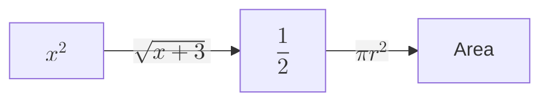
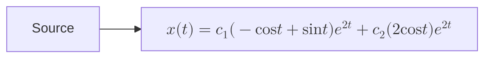

# Rendering Validation Sample

## Body math

본문 inline math인 $u \in L^p(\Omega)$와 약도함수 표기 $D^\alpha u$가 일반 문장 안에서 깨지지 않아야 한다.

display math는 같은 section 안에서 별도 줄로 표시된다.

$$
W^{k,p}(\Omega) =
\{u \in L^p(\Omega): D^\alpha u \in L^p(\Omega), |\alpha| \le k\}
$$

## Short labels

짧은 node label과 edge label은 Mermaid renderer가 직접 처리한다.



## Long label

긴 수식 label은 잘림과 겹침을 확인한다.



## Code fences

코드 블록은 language label과 syntax highlight가 유지되어야 한다.

```python
def weak_derivative_symbol(alpha: str) -> str:
    return f"D^{alpha} u"
```

```tsx
export function InlineMathCheck() {
  return <span>Rendered by ContentRenderer</span>;
}
```

## Fallback rule

이 문서가 깨지면 Mermaid label 안 수식은 기본 작성 규칙으로 쓰지 않는다.

복잡한 수식은 diagram 밖의 display math로 분리한다.

$$
x(t)=c_1
\begin{bmatrix}
-\cos t+\sin t\\
2\cos t
\end{bmatrix}
e^{2t}
$$
